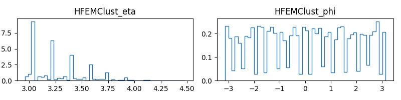

# Issues

### Table of Contents

1. [Parallel Jobs](#parallel-jobs)
2. [Global Tag Not Compatible between Codes](#global-tag-not-compatible-between-codes)
3. [Why different outputs from the same code just changing the global tag?](#why-different-outputs-from-the-same-code-just-changing-the-global-tag)
4. [Wierd Plots for $\eta$ and $\phi$ distribution](#wierd-plots-for--and--distribution)

## Parallel jobs

The code in `analysis_cmsDriver` was used to run `20 jobs` each for `1000 events` but if the outputs of the jobs i.e. `step3_jobID{$PROCESS}.root` is merged by `hadd`, the HF Analyse code runs over just first 1000 events. On inspecting the merged file using `edmFileUtil` tool, it seems that the `step3_merged.root` file created by `hadd` has `(20 runs, 20 lumis, 20000 events, 20369113001 bytes)`. Now the HF Analyse code runs only over run 1 and lumisection 1, which contain 1000 events.

1. So the issue is, <b>` How to loop over all the events ?? `</b>

2. How to parallelise the cms workflow effectively??

3. Is the use of `hadd` tool to merge the root file effective or should some other method of merging file be used? If yes, How to merge the root file?

## Global Tag Not Compatible between Codes

The code present in the `analysis_cmsDriver` uses a global tag : `auto:run3_mc_GRun` but if the global tag is switched to `auto:phase1_2022_realistic`, the code doesn't work.
The code gives the error like:

```
ERROR: The requested algorithm name = L1_DoubleJet_85_35_DoubleJet35_Mass_Min600_Mu3OQ
does not exists in the trigger menu.
Returning zero pointer for getObjectMap

(also)

Algorithm L1_AXO_VTight, requested as seed by a HLT path, cannot be matched to a L1 algo name in any GlobalObjectMap
Please check if algorithm L1_AXO_VTight is present in the L1 menu
```

It seems from the error that the HLT menu and L1Trigger menu are causing the conflicts. 

This issue happens with GT: phase1_2022_realistic in code present in `analysis_cmsDriver/step2...` file. The step1 python file works fine without any error.

The GT `run3_mc_GRun` seems to work fine with the old code `analysis_shared`.

## Why different outputs from the same code just changing the global tag?

It has been observed that if the global tag is changed in the `analysis_cmsDriver`, it is observed that the entries in the final analysis nTuple.root has more number of entries in one GT then other.

* Also noticed that the no of entries are <b>increased</b> if the particles are shot at a distance of `11.45 m` from the intraction point, instead of the usual `11.2 m`.

This type of behavior has not been analysed on the code present in `analysis_shared`. So could not comment on that.

## Wierd Plots for $\eta$ and $\phi$ distribution

The plots for $\eta$ and $\phi$ shows random peaks which is not explained till now.

The plots are like this: 




As seen from the plots the Eta and Phi distributions have random peaks and does not have a continuous distribution. 

What could be the reason for this?
